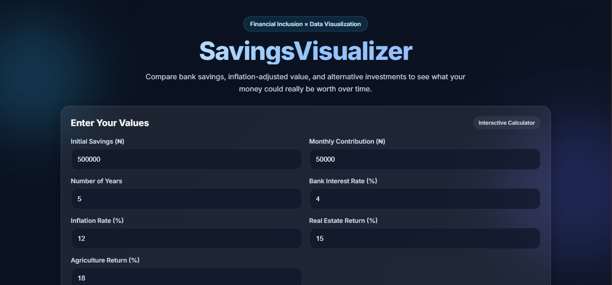
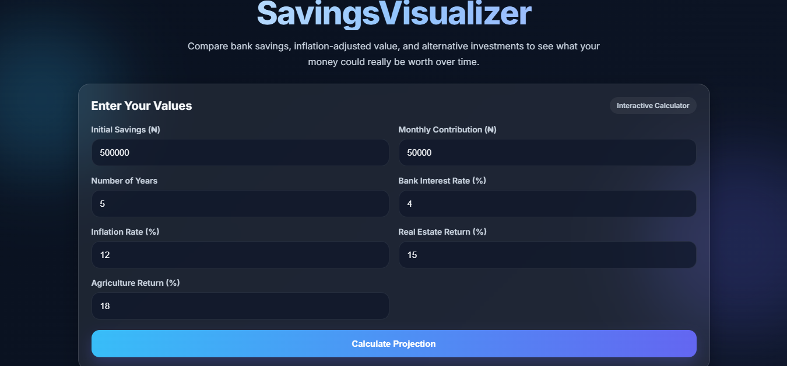
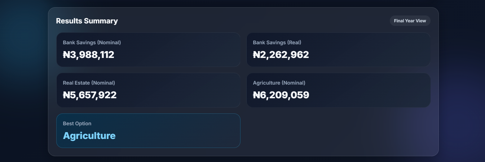
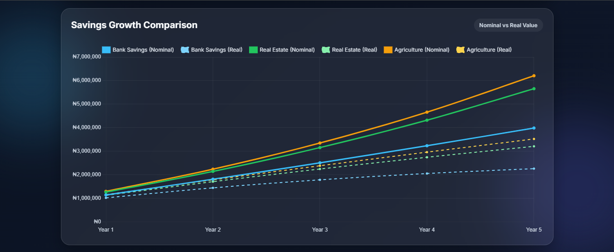
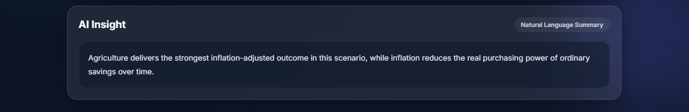

# SavingsVisualizer

## Overview

SavingsVisualizer is an interactive financial calculator that helps young professionals understand how inflation affects their savings over time.

It compares:

* Bank savings growth
* Inflation-adjusted value of money
* Alternative investment returns (real estate and agriculture)

The goal is to help users make smarter financial decisions by showing the real value of money, not just the visible balance.

---

## Problem Statement

Many young professionals keep their money in savings accounts without realizing that inflation reduces its purchasing power over time.

As a result, even though their savings appear to grow, the real value of their money may be decreasing.

---

## Solution

This project provides an interactive web tool that allows users to:

* Input their savings and contribution plan
* Compare different financial scenarios
* Visualize growth over time
* Understand the impact of inflation on their money

---

## Key Features

* Interactive financial calculator
* Inflation-adjusted analysis
* Comparison of multiple investment options
* Dynamic chart visualization using Chart.js
* AI-generated insights using Hugging Face API
* Clean and modern dashboard design

---

## How It Works

The application calculates:

1. Bank savings growth using compound interest
2. Investment growth for real estate and agriculture
3. Inflation impact using real value adjustment

Formula used:
Real Value = Nominal Value / (1 + Inflation Rate)^Years

---

## Technologies Used

* HTML
* CSS
* JavaScript (Vanilla)
* Chart.js
* Hugging Face API (AI Insight Generation)

---

## Live Demo
https://apetbally.github.io/savings-visualizer/
---

## Screenshots

### Full Dashboard View

### Results Section

### Chart Visualization

### AI Insight

---

## Project Structure

* index.html
* style.css
* script.js

---

## Future Improvements

* Use real-world inflation data
* Add more investment options
* Include risk analysis
* Add backend for secure API handling

---

## Author

Balikis Apete

---

## Conclusion

SavingsVisualizer highlights the importance of understanding inflation and encourages better financial decision-making by focusing on the real value of money rather than just nominal growth.
